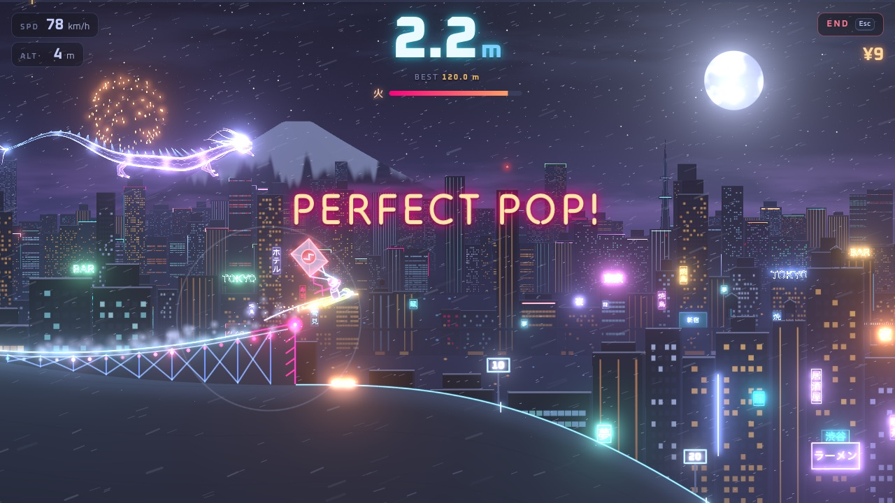

# Tokyo Flyer 東京フライヤー

A neon night-time sled-launch game in Three.js. Slide down a snowy in-run, pop off the kicker, and fly as
far as you can over Tokyo while dragons drift across the sky. Every run earns yen; spend it on better
sleds, higher start gates, boosters, gliders and charms, then go again. Reach Tokyo Tower at 3,333 m to win.



## Controls

| | Keyboard | Touch |
|---|---|---|
| Tuck (in-run) / nose down (air) | ↓ or S | ▼ |
| Pop at the lip / nose up (air) | ↑ or W | ▲ |
| Booster | Space or Shift | BOOST |
| End run | Esc | END |

Tips: tuck all the way down the in-run and tap ↑ in the last instant before the lip for a perfect pop.
Land with the sled parallel to the snow. With a glider, keep the nose a little above your direction of
travel — too high and it stalls, dive to pick up speed, pull up to trade it for height.

## Run it

No build step and no dependencies — any static file server works:

```sh
python3 -m http.server 8000   # then open http://localhost:8000
```

## Physics

`src/physics.js` is a small custom model tuned for feel, and runs unchanged in Node:

- Fixed 240 Hz step with render interpolation; the whole game runs at 1.2× time scale.
- Terrain is an analytic height field (value, slope and curvature), so the rider is glued to the snow by
  the real normal force `N = g·cosθ + v²κ` and takes off over crests exactly when `N` drops below zero.
- Coulomb friction (sled μ, plus deep powder after the lip), quadratic drag (tucking cuts it), booster
  thrust along the body.
- Gliders: lift `CL = cla·α` up to stall, induced drag, stall break. Lift is applied as a rotation of the
  velocity vector, so no pitch-pumping trick can create energy (asserted in the tests).
- Touchdown is found by bisection; landings are judged by body-vs-slope angle and impact speed into the
  snow (butter, clean, sketchy, hard, wipeout). Butter landings and landed flips give a speed kick.

```sh
node test/sim.mjs            # physics self-checks + distance per loadout
node test/sim.mjs progress   # simulated playthrough with a bot pilot
```

## Credits

Built with [three.js](https://threejs.org) (MIT, vendored in `vendor/three`). Colors from the
[Tokyo Night](https://github.com/folke/tokyonight.nvim) palette. MIT licensed.
